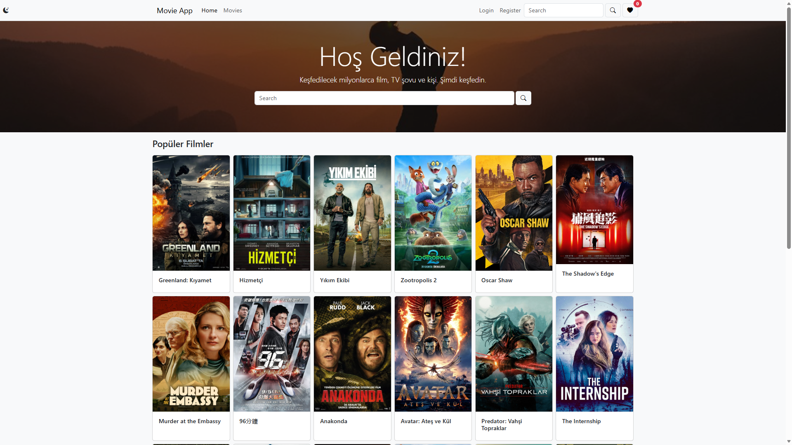
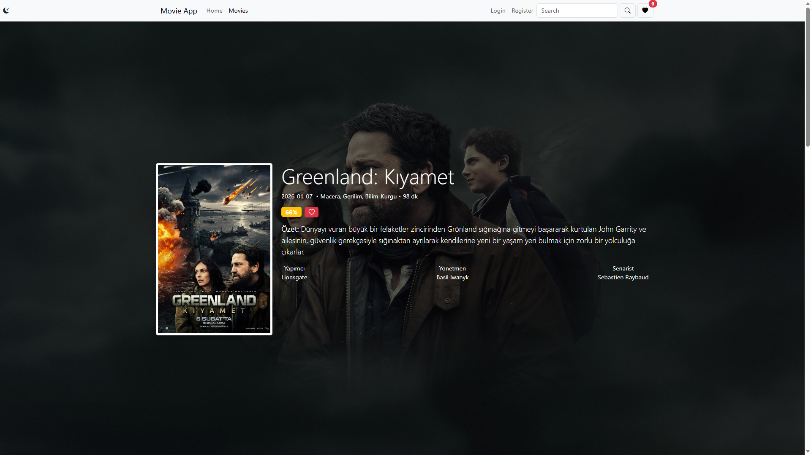
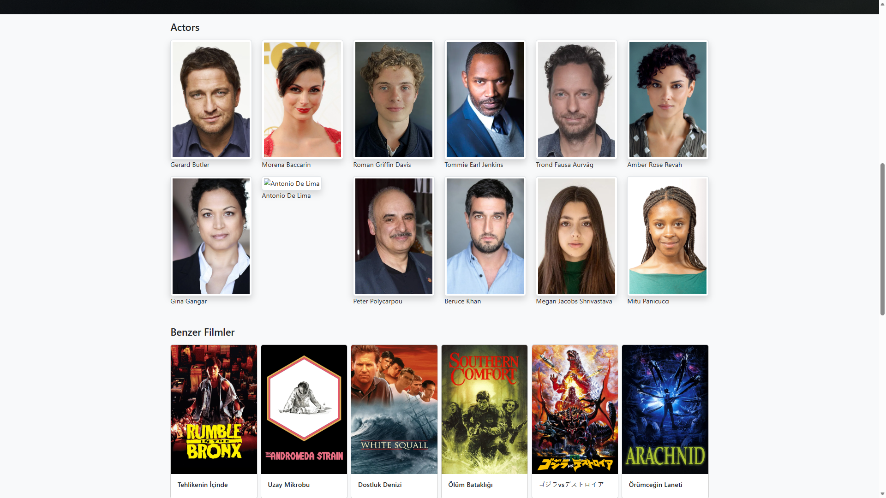
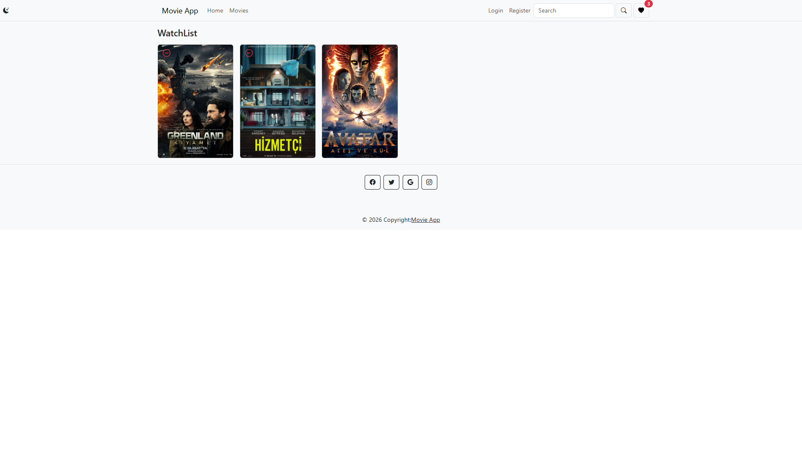

# 🎬 React Movie App

<details>
<summary><strong>Click For English Description [EN]</strong></summary>
<br>
  
## 🚀 About the Project

Developed as part of a Udemy React course, this project focuses on managing dynamic data flow rather than a static interface. It's an interactive structure where users can search for movies, view details, create their own "Watchlist," and manage theme preferences.

The project is built using **Vite**, resulting in a modular and performance-oriented structure.

## 🛠️ Technologies Used

* **Core:** React (Functional Components & Hooks), JavaScript (ES6+)
* **Build Tool:** Vite

* **Routing:** React Router DOM (v6+ `createBrowserRouter`, `NavLink`, `Link`)
* **Data Source:** TMDB API (The Movie Database)
* **State Management:** Context API (Theme & Watchlist Context)

* **Style:** CSS, Bootstrap

* **Other:** LocalStorage (for data persistence)

## ✨ Key Features

* **🔍 Advanced Search & Pagination:** Instant movie search using data from the API and pagination for navigating between results. * **🌗 Dark / Light Mode:** Dynamic theme support managed with `ThemeContext` and storing user preferences in `LocalStorage`.
* **❤️ Favorites (Watchlist):** A watchlist where users can add and remove movies they like, which doesn't disappear even when the browser is closed (with `UserContext` structure).
* **📄 Movie Details:** Listing the cast, synopsis, and similar movie suggestions of the selected movie with a dynamic route structure. * **🔐 Form Validation:** Instant data validation and error handling with a custom hook (`useInput`) written specifically for login and registration processes.
</details>

<details>
<summary><strong>Türkçe Açıklama için Tıklayınız [TR]</strong></summary>
<br>
  
## 🚀 Proje Hakkında

Udemy React kursu kapsamında geliştirilen bu proje, statik bir arayüzden ziyade dinamik veri akışını yönetmeye odaklanır. Kullanıcıların film araması yapabildiği, detayları görüntüleyebildiği, kendi "İzleme Listesini" oluşturabildiği ve tema tercihlerini yönetebildiği etkileşimli bir yapıdır.

Proje **Vite** kullanılarak oluşturulmuş, modüler ve performans odaklı bir yapı kurgulanmıştır.

## 🛠️ Kullanılan Teknolojiler

* **Core:** React (Functional Components & Hooks), JavaScript (ES6+)
* **Build Tool:** Vite
* **Yönlendirme (Routing):** React Router DOM (v6+ `createBrowserRouter`, `NavLink`, `Link`)
* **Veri Kaynağı:** TMDB API (The Movie Database)
* **State Yönetimi:** Context API (Theme & Watchlist Context)
* **Stil:** CSS, Bootstrap
* **Diğer:** LocalStorage (Veri kalıcılığı için)

## ✨ Temel Özellikler

* **🔍 Detaylı Arama & Sayfalama:** API üzerinden gelen verilerle anlık film araması ve sonuçlar arasında sayfalama (pagination) ile gezinebilme özelliği.
* **🌗 Dark / Light Mod:** `ThemeContext` ile yönetilen ve kullanıcının tercihini `LocalStorage` üzerinde saklayan dinamik tema desteği.
* **❤️ Favoriler (Watchlist):** Kullanıcıların beğendiği filmleri ekleyip çıkarabildiği, tarayıcı kapansa bile kaybolmayan izleme listesi (`UserContext` yapısı ile).
* **📄 Film Detayları:** Seçilen filmin oyuncu kadrosu, özeti ve benzer film önerilerini dinamik route yapısıyla listeleme.
* **🔐 Form Validasyonu:** Giriş ve kayıt işlemleri için özel yazılmış Custom Hook (`useInput`) ile anlık veri doğrulama ve hata yönetimi.
</details>

## 📸 Screenshots
 
| Homepage | Movie Details |
| :---: | :---: |
|  |  |

| Similar Movies & Actors | Watch List |
| :---: | :---: |
|  |  |


## 💻 Installation and Operation

To run the project on your local server, you can follow these steps:

1. Clone the project:
    ```bash
    git clone https://github.com/elifavcu0/movie-app.git
    ```
2. Go to the project directory and install the necessary packages:
    ```bash
    cd movie-app
    npm install
    ```
3. Launch the application:
    ```bash
    npm run dev
    ```

---
*This project was developed as part of the React learning process.*
